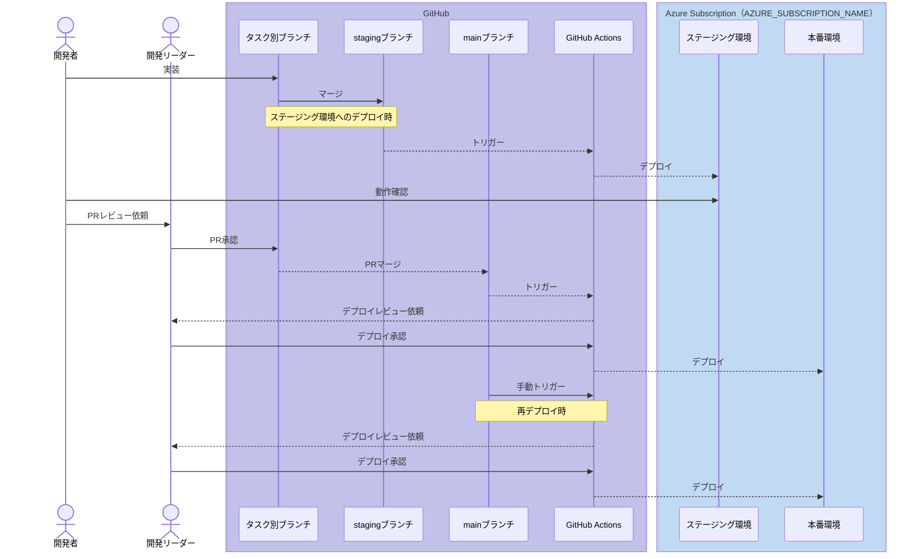

# CI/CD ワークフローのセットアップ手順

## CI/CD フロー図

## 手順

1. GitHub Environments の作成 (GitHub)
1. Entra ID アプリの作成 (Azure)
1. フェデレーション資格情報の構成 (Azure)
1. リソースに対するロール付与 (Azure)
1. GitHub Actions Variables に環境変数を設定 (GitHub)
1. ワークフローの実行テスト (GitHub)

### 1. GitHub Environments の作成 (GitHub)

GitHub リポジトリの Environments メニューを開き、 Environments を二つ（ `Production` , `Staging` ）作成します。
[デプロイに環境の使用 - GitHub Docs](https://docs.github.com/ja/actions/managing-workflow-runs-and-deployments/managing-deployments/managing-environments-for-deployment#creating-an-environment)

作成後、 `Production` を開いて `Required reviewers` にチェックを入れ、デプロイ承認者を設定します。

### 2. Entra ID アプリの作成 (Azure)

Entra ID の[「アプリの登録」ブレード](https://portal.azure.com/#view/Microsoft_AAD_IAM/ActiveDirectoryMenuBlade/~/RegisteredApps)を開き、「新規登録」ボタンからアプリケーションの登録を行います。
Production, Staging の二環境に対して必要なため、同じ要領で二つ用意しておきます。

入力値：

- 名前：任意の値（例： `GitHubOIDCForAppDeploymentProduction` , `GitHubOIDCForAppDeploymentStaging` ）
- サポートされているアカウントの種類： `この組織ディレクトリのみに含まれるアカウント (YOUR_TENANT_NAME のみ - シングル テナント)`
- リダイレクト URI (省略可能) ：入力無し

### 3. フェデレーション資格情報の構成 (Azure)

作成した Entra ID アプリを開き、「証明書とシークレット」ブレードから「フェデレーション資格情報」タブを開きます。
「資格情報の追加」を押下し、下記の通り入力します。（作成した Entra ID アプリ二つに対してそれぞれ追加を行ってください。）

入力値：

- フェデレーション資格情報のシナリオ： `Azure リソースをデプロイする GitHub Actions`
- 組織： GitHub リポジトリを所有している Organization 名
- リポジトリ： GitHub リポジトリ名
- エンティティ型： `環境`
- GitHub 環境名： `Production` または `Staging` (作成した Entra ID アプリ二つにそれぞれ設定してください)
- 名前：任意の値（例： `リポジトリ名-Production` ）
- 説明：任意の値

### 4. リソースに対するロール付与 (Azure)

以下手順を本番環境用リソースと検証環境用リソースのそれぞれに実施します。

Azure ポータルから Web App リソースを開き、「アクセス制御 (I AM)」ブレードを開きます。
「追加」を押下し、「ロールの割り当ての追加」を押下します。
「ロール」タブのまま「特権管理者ロール」タブを開き、 `共同作成者` を選択します。
「メンバー」タブを開き、「メンバーを選択する」から先程作成した Entra ID アプリを選択します（本番環境用リソースには Production に接続しているアプリを、検証環境用リソースには Staging に接続しているアプリを選択します）。
「レビューと割り当て」タブを開き、エラーが出ないことを確認して「レビューと割り当て」ボタンを押下します。

### 5. GitHub Actions Variables に環境変数を設定 (GitHub)

再度 GitHub リポジトリの Environments メニューを開き、各 Environments に対して下記の通り Environment variables を追加します。

| key | val |
| --- | --- |
| AZURE_CLIENT_ID | Entra ID アプリのクライアント ID |
| AZURE_TENANT_ID | デプロイ先リソースのテナント ID |
| AZURE_SUBSCRIPTION_ID | デプロイ先リソースのサブスクリプション ID |
| AZURE_ENV_NAME | azd init 時に使用した env 文字列 |
| AZURE_LOCATION | デプロイ先リソースのリージョン名 |
| AZURE_RESOURCE_GROUP | デプロイ先リソースのリソースグループ名 |

### 6. ワークフローの実行テスト (GitHub)

GitHub リポジトリの Actions タブを開き、左のメニューから該当のワークフロー名（ `Azure Developer CLI` ）を選択します。
`Run workflow` ボタンが表示されるので押下し、 Branch に `main` または `staging` を選択したうえ `Run workflow` ボタンを押下します。
ワークフロー実行が正常に完了することを確認します。
