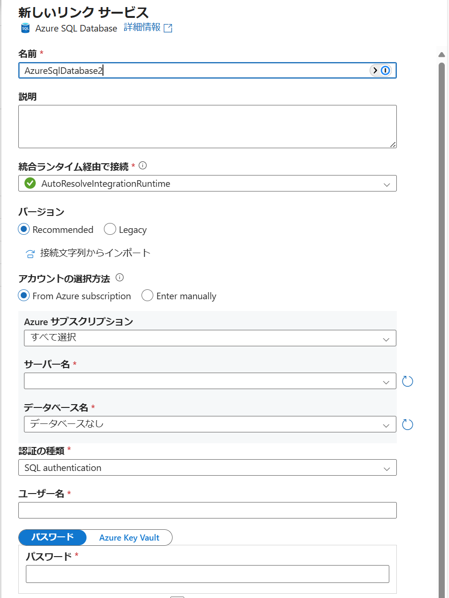
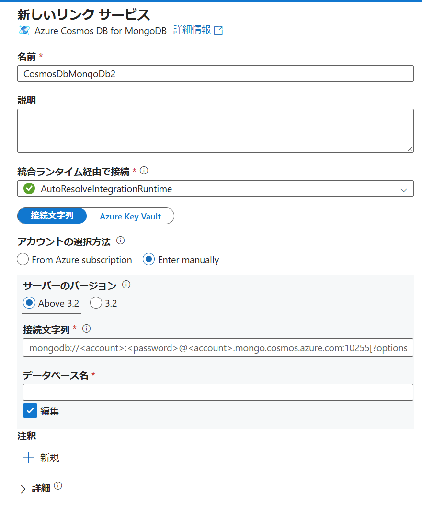
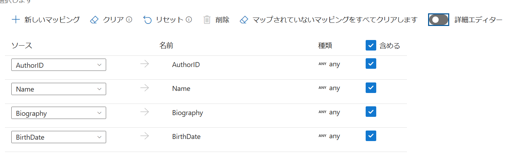
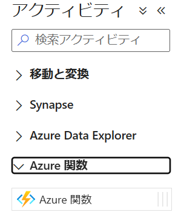
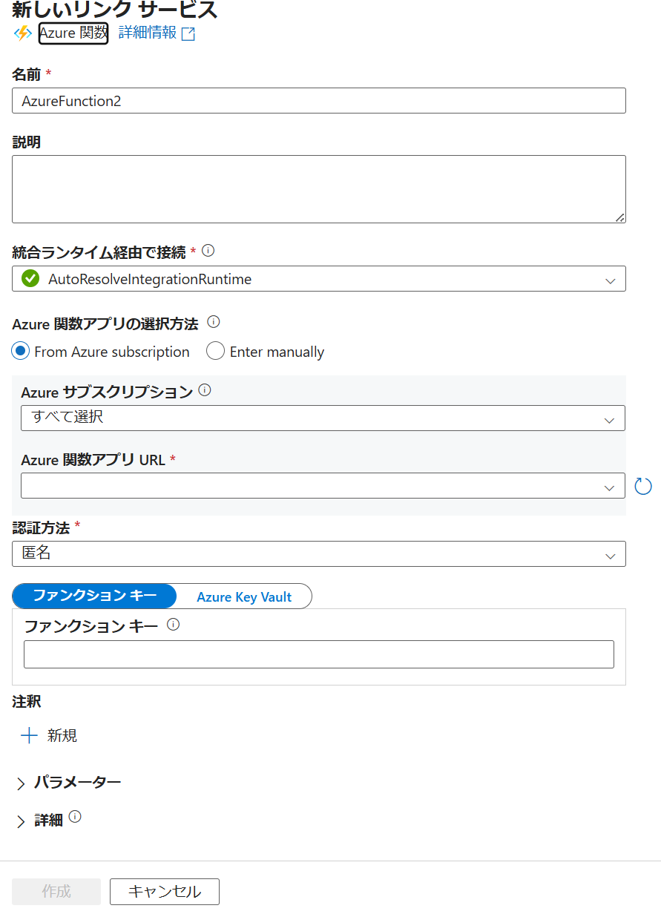
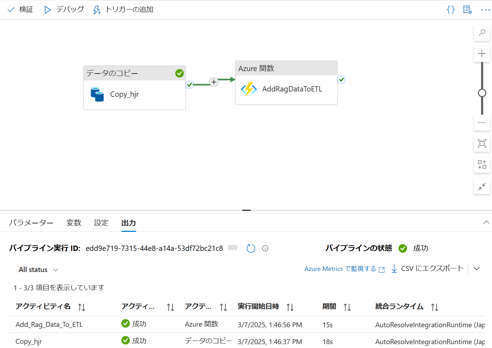

# ETL用Azure Data Factoryセットアップ手順

## 手順

1. 移行先Azure Cosmos DBにコレクションを作成
1. Azure Data Factoryの設定
1. 移行先Azure Cosmos DBからデータ確認

## 1. 移行先Azure Cosmos DBにコレクションを作成

MongoDB Shellを使用してコレクションの作成を行います。  
[MongoDB Shell を使用して接続する - Azure Cosmos DB for MongoDB in vCore architecture | Microsoft Learn](https://learn.microsoft.com/ja-jp/azure/cosmos-db/mongodb/vcore/how-to-connect-mongo-shell)

```shell
use <データベース名>
db.createCollection('<コレクション名>')
```

## 2. Azure Data Factoryの設定

### スタジオの起動

リソースの `概要` から `スタジオの起動` を選択してData Factory Studioを起動します。  
Data Factory Studioのホーム画面から `取り込み` を選択します。  
データコピーツールが立ち上がるので、 `次へ` を選択します。

### ソース（Azure SQL Databaseの例）

`新しい接続` を選択し、 `Azure SQL Database` を選択します。  
表示されたパネルで必須項目を入力します（検証時はSQL authenticationを使用）。



各値入力後、 `テスト接続` を押下しエラーが出ないことを確認してから `作成` を選択します。  
その後SQLのテーブルの一覧が表示されるので、コピーしたいテーブルを選択します。  
`構成` タブで `次へ` を選択します。

### 宛先（Azure Cosmos DB for MongoDB）

`新しい接続` を選択し、 `Azure Cosmos DB for MongoDB` を選択します。

表示されたパネルで必須項目を入力します。  
`サーバーのバージョン` は **Above 3.2** を選択するよう注意してください。



各値入力後、 `テスト接続` を押下しエラーが出ないことを確認してから `作成` を選択します。  
その後SQLのテーブルの一覧が表示されるので、コピーしたいテーブルを選択します。  
ソースのテーブルに対し宛先を設定することができるようになるので、手順「1. 移行先Azure Cosmos DBにコレクションを作成」で作成したコレクションを選択します。

`構成` タブで下記手順を実施し、マッピングを作成しなおします（UIからマッピング設定をする場合、デフォルト値で一度作成を行う必要があるために発生する手順です）。

設定画面：



手順：

1. 既存のマッピングを `ゴミ箱` ボタンで削除します
1. `詳細エディター` のトグルを押下しオフにします
1. `＋新しいマッピング` ボタンを押下し新しいマッピングを作成します
1. `列の選択または編集` リストから任意の列を選択します
1. 宛先の `名前` がデフォルトでは `Column_<数字>` になっているので、一つ前の手順4で選択した列の名前に変更します
1. 手順4と手順5のリスト選択・名前変更の作業を繰り返し、全てのテーブルのマッピングを行います

`設定` タブで任意のタスク名を設定します。  
`レビュー` タブで内容を確認し、 `次へ` を押下します。  
コピー処理が実行されるので、処理が終わり次第 `終了` を押下します。

## 3. 移行先Azure Cosmos DBからデータ確認

### コマンド例

#### データベースの一覧を表示
```shell
show.dbs
```

#### データベースの切り替え
```shell
use <データベース名>
```

#### 特定のコレクションの中身を表示

```shell
db.<コレクション名>.find().pretty()
```

#### コレクション内のすべてのドキュメントの件数を返す

```shell
db.<コレクション名>.countDocuments()
```

#### コレクションの中身を削除

```shell
db.<コレクション名>.deleteMany({})
```

## 4. RAGのデータ追加に向けてAzure Cosmos DBからデータ削除

[手順3](#3-移行先azure-cosmos-dbからデータ確認)から`コレクションの中身を削除`コマンドを実行、またはAzure 関数より`Delete_Data`関数を実行します。

## 5. Azure Data FactoryとAzure 関数の接続と実行
### パイプライン デザイナー画面の起動

リソースの `概要` から `スタジオの起動` を選択してData Factory Studioを起動します。
Data Factory Studioのホーム画面から `作成者`を選択し、 `ファクトリーのリソース`の`パイプライン`タブの中から[手順2](#2-azure-data-factoryの設定)で作成したパイプラインを選択し、 パイプライン デザイナー画面を起動します。


### Azure 関数の追加

`アクティビティ`から`Azure 関数`をパイプライン デザイナー画面にドラッグ アンド ドロップします。
`全般`タブからアクティビティの`名前`を任意の名前に設定します。



### Azure 関数の設定
`設定`タブを選択し、 `Azure 関数のリンク サービス`から`新規`を選択します。
表示されたパネルで必須項目を入力します。



各種入力後、 `関数名`は`Add_Rag_Data_To_ETL`と入力し、 `メソッド`は`GET`を選択します。

### パイプラインとAzure 関数の接続と実行
`コピー` アクティビティの横にある緑のチェックボックス ボタンを `Azure 関数` アクティビティにドラッグ アンド ドロップして、`コピー` アクティビティを `Azure 関数` アクティビティに接続します。

パイプライン デザイナー画面から`デバッグ`を選択し、 処理を流します。
`出力`タブのアクティビティが全て成功していることを確認してください。



