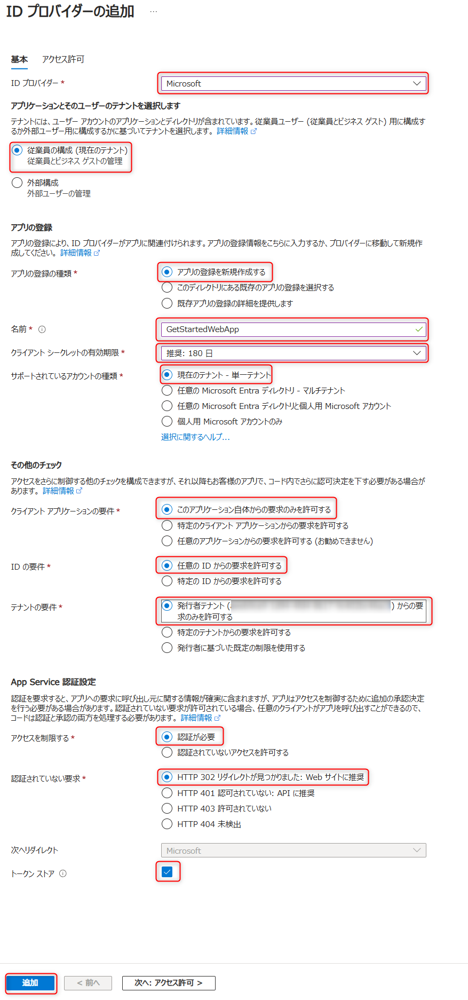

# Azure App Service での Web アプリ認証（Easy Auth）のセットアップ

## セットアップ手順

今回は ID プロバイダーとして Microsoft Entra を使用します。  
参考： [Microsoft Entra 認証を構成する - Azure App Service | Microsoft Learn](https://learn.microsoft.com/ja-jp/azure/app-service/configure-authentication-provider-aad)

1. [Azure portal](https://portal.azure.com) にアクセスしログインします。
1. 該当の Web App リソースを開き、左側のメニューから [**認証**] を選び、[**ID プロバイダーの追加**] を選びます。
1. [**ID プロバイダーの追加**] ページで、Microsoft および Microsoft Entra ID にサインインするための ID プロバイダーとして [**Microsoft**] を選択します。
1. [**テナントの種類**] で、従業員とビジネス ゲストについて [**従業員の構成 (現在のテナント)**] を選びます。
1. [**アプリの登録**]>[**アプリの登録の種類**] で、[**新しいアプリの登録を作成する**] を選び、Microsoft Entra で新しいアプリの登録を作成します。
1. アプリケーションの表示名を入力します。 表示名は、サインイン時など、アプリケーションのユーザーがアプリを使用するときに表示されることがあります。
1. [**クライアント シークレットの有効期限**] については、[**推奨:180 日**] を選択します。
1. [**アプリの登録**]>[**サポートされているアカウントの種類**] で、[**現在のテナント - 単一テナント**] を選択して、組織のユーザーのみが Web アプリにサインインできるようにします。
1. [**追加チェック**] セクションで、次を選択します。
    - [**クライアント アプリケーション要件**] に対して [**このアプリケーション自体からの要求のみを許可する**]
    - [**ID の要件**] に対して [**任意の ID からの要求を許可する**]
    - [**テナント要件**] に対して [**発行者テナントからの要求のみを許可する**]
1. [**App Service の認証設定**] セクションで以下を設定します。
    - [**アクセスを制御する**] に対して [**認証が必要**]
    - [**認証されていない要求**] に対して [**HTTP 302 リダイレクトが見つかりました - Web サイトに推奨**]
    - [**トークン ストア**] ボックス
1. [**ID プロバイダーの追加**] ページの下部にある [**追加**] を選び、対象の Web アプリの認証を有効化します。

### 認証設定のスクリーンショット

