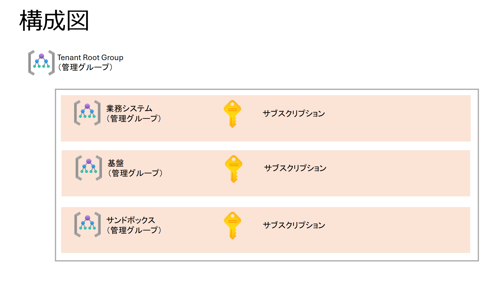
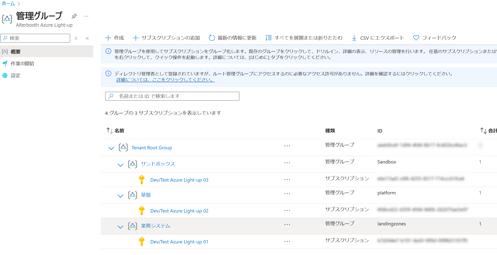

### 管理グループの作成とサブスクリプションの紐づけ

#### 構成図



#### 実行手順

- 前提条件として、実行するユーザーはルートテナントグループのスコープで「所有者」の権限を持つこと

1. 以下のコマンドでテナントを指定してログイン

```bash
az login --tenant {テナントID}
```

2. 以下のコマンドを実行して管理グループの作成とサブスクリプションの紐づけを行う

```bash
region=japaneast
rootGroupId=<ルートテナントグループの管理グループID>
```

3. `main.bicepparam` にパラーメータを設定する

```
param subscriptionLandingZonesGroupId = <業務システム管理グループに紐づけるサブスクリプション ID>
param subscriptionPlatformGroupId = <基盤管理グループに紐づけるサブスクリプション ID>
param subscriptionSandboxGroupId = <サンドボックス管理グループに紐づけるサブスクリプション ID>

param actionGroupEmail = <全サブスクリプション共通アラートの送付先メールアドレス>
```

4. 以下のコマンドを実行してデプロイ

```bash
az deployment mg create --template-file main.bicep \
--location $region --management-group-id $rootGroupId \
--parameters main.bicepparam

```

5. 動作確認
   以下のキャプチャの通り作成された管理グループ下にサブスクリプションが紐づいている事を確認する
   
